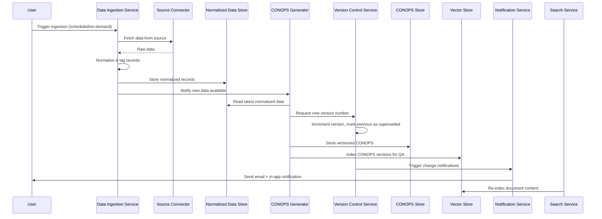
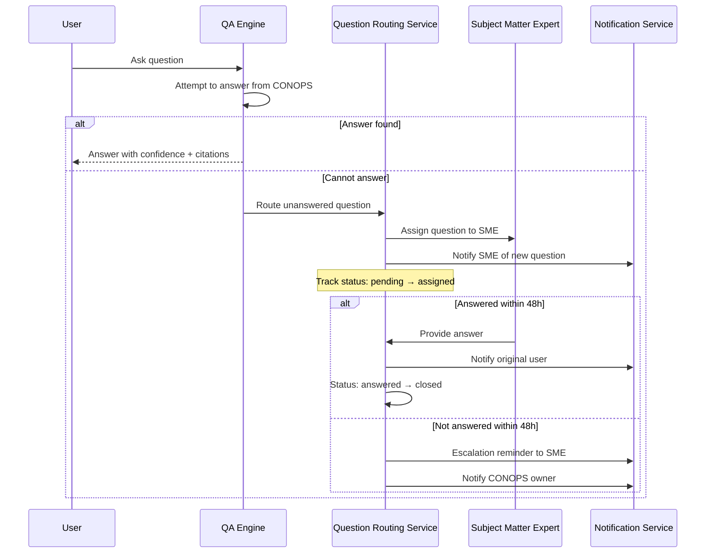

# Design Document: CPF Predictive Analysis Tool

## Overview

The CPF Predictive Analysis Tool, called CONOPS One Source, is an AI-powered system that provides COMPACFLEET (Commander Pacific Fleet) users with predictive insights into the impact of proposed changes to CPF asset operations. The system ingests operational and sustainment data from heterogeneous sources (network shares, SharePoint, web pages), synthesizes a unified Concept of Operations (CONOPS) page, and exposes a natural language question-answering interface over the CONOPS. A predictive analysis engine evaluates proposed changes against current data to produce impact assessments with confidence scores, cascading effect analysis, and resource reallocation recommendations.

The system enforces a single-source-of-truth model for the CONOPS document through a Version Control Service that maintains monotonically increasing version numbers, prevents conflicting concurrent modifications, and retains all historical versions. An NLP QA Engine provides grounded answers with confidence indicators and routes unanswered questions to designated SMEs via a Question Routing Service. Automated change notifications alert registered users when new CONOPS versions are published. A keyword Search Service complements the AI-powered QA with traditional boolean/phrase search. An immutable, append-only Audit Trail Service tracks all CONOPS document changes at the section level. Users can submit feedback on CONOPS content through a Feedback Service, and a Document Comparison Service enables side-by-side diff views between any two CONOPS versions. An Integration Gateway provides a documented API, webhook support, and a plugin architecture for external system connectivity.

The web page for CONOPS One Source uses username and password authentication with role-based access control supporting three roles: admin, standard user, and read-only viewer. Admin users can manage user accounts including adding, removing, deactivating (without deletion), and resetting passwords. New users must change their password on first login. The data is stored in a local PostgreSQL database.

All AI components (CONOPS Generator, Predictive Analysis Engine, QA Engine) use a locally hosted Gemma model (current version) served by Ollama for inference. Ollama exposes an OpenAI-compatible API endpoint, and the LLM Gateway connects to this endpoint for all model requests. There are no cloud LLM dependencies. The entire application is containerized via Docker and designed to run on a single machine, enabling portable deployment — an administrator can download the code and deploy it to any Docker-capable host.

### Key Design Decisions

1. **Event-driven ingestion pipeline** — Data ingestion is modeled as an asynchronous pipeline with retry semantics, allowing scheduled and on-demand runs without blocking the user.
2. **Versioned CONOPS with single-source-of-truth guarantees** — Each CONOPS generation produces an immutable versioned snapshot with a monotonically increasing version number. The Version Control Service ensures exactly one authoritative version exists at any time, prevents conflicting concurrent modifications, and retains all superseded versions for historical reference.
3. **RAG-based QA with confidence and routing** — The QA interface uses Retrieval-Augmented Generation over CONOPS sections to provide cited, contextual answers with session memory. Answers include confidence indicators and CONOPS section references. Questions the NLP engine cannot answer are automatically routed to SMEs via the Question Routing Service.
4. **Pluggable data source connectors** — Each source type (network share, SharePoint, web page) is implemented as a connector behind a common interface, making the system extensible.
5. **Local Gemma LLM via Ollama** — All AI inference (CONOPS generation, predictive analysis, QA) runs against a locally hosted Gemma model served by Ollama, which exposes an OpenAI-compatible API endpoint. This eliminates cloud LLM dependencies and enables air-gapped deployment.
6. **Containerized single-machine deployment** — The entire stack (application, database, Ollama model server with Gemma, vector store) is packaged as Docker containers orchestrated via Docker Compose, enabling one-command deployment on any Docker-capable machine.
7. **Three-tier role-based access control** — Admin, standard, and read-only viewer roles with account deactivation (preserving audit history) and mandatory first-login password change.
8. **Immutable append-only audit trail** — All CONOPS document changes are logged in an immutable, append-only audit log with section-level granularity. Records cannot be modified or deleted and are retained for the lifetime of the system.
9. **Plugin-based integration architecture** — The Integration Gateway uses a plugin architecture so new external system integrations can be added without modifying core application code. All external interactions are authenticated, access-controlled, and logged to the Audit Trail Service.

## Architecture

The system follows a layered architecture with four primary subsystems connected through an internal event bus and a shared data store. All AI components communicate with a locally hosted Gemma model via an internal LLM Gateway. New services (Notification, Question Routing, Search, Feedback, Document Comparison, Integration Gateway) extend the service layer and integrate with the existing data and audit infrastructure.

```mermaid
graph TB
    subgraph "User Interface Layer"
        UI[Web Dashboard]
        QA[QA Chat Interface]
        DSM[Data Source Management UI]
        UMU[User Management UI]
        SRCH[Search UI]
        FB[Feedback UI]
        DIFF[Document Comparison UI]
    end

    subgraph "Service Layer"
        DIS[Data Ingestion Service]
        CG[CONOPS Generator]
        VCS[Version Control Service]
        PAE[Predictive Analysis Engine]
        QAE[QA Engine / NLP QA Engine]
        AUD[Audit Trail Service]
        ACS[Access Control Service]
        NS[Notification Service]
        QRS[Question Routing Service]
        SS[Search Service]
        FBS[Feedback Service]
        DCS[Document Comparison Service]
        IG[Integration Gateway]
    end

    subgraph "AI Layer"
        LLM[LLM Gateway]
        OLL[Ollama Server]
        GEMMA[Local Gemma Model]
    end

    subgraph "Connector Layer"
        NSC[Network Share Connector]
        SPC[SharePoint Connector]
        WPC[Web Page Connector]
    end

    subgraph "Data Layer"
        NDS[(Normalized Data Store)]
        CS[(CONOPS Store)]
        AL[(Audit Log - Append Only)]
        VEC[(Vector Store)]
        UDB[(User Store)]
        NDB[(Notification Store)]
        QDB[(Question Routing Store)]
        FDB[(Feedback Store)]
    end

    UI --> PAE
    UI --> CG
    UI --> VCS
    QA --> QAE
    DSM --> DIS
    UMU --> ACS
    SRCH --> SS
    FB --> FBS
    DIFF --> DCS

    DIS --> NSC
    DIS --> SPC
    DIS --> WPC

    NSC --> NDS
    SPC --> NDS
    WPC --> NDS

    CG --> NDS
    CG --> CS
    CG --> LLM
    CG --> VCS
    VCS --> CS
    VCS --> NS
    PAE --> NDS
    PAE --> CS
    PAE --> LLM
    QAE --> VEC
    QAE --> CS
    QAE --> LLM
    QAE --> QRS
    LLM --> OLL --> GEMMA

    ACS --> UDB
    ACS --> AUD
    NS --> NDB
    NS --> AUD
    QRS --> QDB
    QRS --> NS
    QRS --> AUD
    SS --> VEC
    SS --> CS
    FBS --> FDB
    FBS --> QRS
    FBS --> AUD
    DCS --> CS
    IG --> ACS
    IG --> AUD

    PAE --> AUD --> AL
    QAE --> AUD
    DIS --> AUD
    CG --> VEC
end
```

### Data Flow



### Question Routing Flow



## Components and Interfaces

### 1. Data Ingestion Service

Responsible for orchestrating data collection from configured sources, normalizing records, and managing retry logic.

**Interface:**

```
DataIngestionService:
  configureSources(config: DataSourceConfig) -> ValidationResult
  triggerIngestion(sourceId?: string) -> IngestionJob
  getIngestionStatus(jobId: string) -> IngestionStatus
  listSources() -> DataSource[]
  addSource(source: DataSourceConfig) -> DataSource
  editSource(sourceId: string, updates: Partial<DataSourceConfig>) -> DataSource
  removeSource(sourceId: string) -> ConfirmationResult
  testConnectivity(sourceId: string) -> ConnectivityResult
```

**Connector Interface (pluggable per source type):**

```
SourceConnector:
  connect(config: ConnectionConfig) -> ConnectionResult
  fetch(query?: FetchQuery) -> RawDataBatch
  testConnection(config: ConnectionConfig) -> ConnectivityResult
  disconnect() -> void
```

Implementations: `NetworkShareConnector`, `SharePointConnector`, `WebPageConnector`

### 2. CONOPS Generator

Synthesizes normalized data into a versioned CONOPS document with required sections. Delegates version management to the Version Control Service.

**Interface:**

```
CONOPSGenerator:
  generate(dataSnapshot: NormalizedDataSet) -> CONOPSDocument
  update(conopsId: string, newData: NormalizedDataSet) -> CONOPSDocument
  getLatest() -> CONOPSDocument
  getVersion(versionId: string) -> CONOPSDocument
  getVersionAtTime(timestamp: DateTime) -> CONOPSDocument
```

### 3. Version Control Service

Manages CONOPS document versioning with single-source-of-truth guarantees. Ensures monotonically increasing version numbers, prevents conflicting concurrent modifications, and retains all historical versions.

**Interface:**

```
VersionControlService:
  publishVersion(document: CONOPSDocument) -> VersionedCONOPS
  getLatestVersion() -> VersionedCONOPS
  getVersion(versionNumber: integer) -> VersionedCONOPS
  listVersions(filter?: VersionFilter) -> VersionSummary[]
  acquireLock(userId: string) -> LockResult
  releaseLock(userId: string, lockId: string) -> void
```

### 4. Predictive Analysis Engine

Evaluates proposed changes against current operational and sustainment data to produce impact assessments.

**Interface:**

```
PredictiveAnalysisEngine:
  analyzeChange(proposal: ChangeProposal) -> ImpactAssessment
  getRecommendations(assessmentId: string) -> ResourceRecommendation[]
  getAssetStatusAtTime(assetId: string, timestamp: DateTime) -> AssetStatus
  generateAuditReport(dateRange: DateRange) -> AuditReport
```

### 5. QA Engine / NLP QA Engine

Provides natural language question-answering over the current CONOPS using RAG. Returns grounded answers with confidence indicators and CONOPS section citations. Routes unanswered questions to the Question Routing Service.

**Interface:**

```
QAEngine:
  ask(sessionId: string, question: string) -> QAResponse
  startSession() -> Session
  endSession(sessionId: string) -> void
  getSessionHistory(sessionId: string) -> QAInteraction[]
```

The `QAResponse` now includes `confidenceScore: float` and `confidenceLevel: "high" | "medium" | "low"`. When the engine cannot determine an answer, it sets `answered: false` and forwards the question to `QuestionRoutingService.routeQuestion()`.

### 6. Audit Trail Service

Cross-cutting service that logs all system actions for traceability. Stores records in an immutable, append-only log. Supports section-level change history for the CONOPS document. Records are retained for the lifetime of the system with no automatic purging.

**Interface:**

```
AuditTrailService:
  logEvent(event: AuditEvent) -> void
  logDocumentChange(change: DocumentChangeEvent) -> void
  query(filter: AuditFilter) -> AuditEvent[]
  getSectionHistory(sectionName: string, filter?: AuditFilter) -> DocumentChangeEvent[]
  generateReport(dateRange: DateRange) -> AuditReport
```

### 7. Access Control Service

Manages user registration, authentication, role-based access control (admin, standard, read-only viewer), account deactivation, and first-login password change. Extends the original User Management Service with additional roles and workflows.

**Interface:**

```
AccessControlService:
  registerUser(adminId: string, userData: CreateUserRequest) -> User
  deactivateUser(adminId: string, userId: string) -> ConfirmationResult
  reactivateUser(adminId: string, userId: string) -> ConfirmationResult
  listUsers(adminId: string) -> UserListEntry[]
  changePassword(requesterId: string, userId: string, newPassword: string) -> ConfirmationResult
  authenticate(username: string, password: string) -> AuthResult
  checkAccess(userId: string, resource: string, action: string) -> AccessDecision
  getSession(sessionToken: string) -> Session | null
  logout(sessionToken: string) -> void
```

`AuthResult` includes `requiresPasswordChange: boolean` for first-login detection. `AccessDecision` returns `{ allowed: boolean, reason?: string }`.

### 8. Notification Service

Sends automated notifications when CONOPS versions are published or other system events occur. Supports email and in-app notification channels. Includes retry logic for failed deliveries.

**Interface:**

```
NotificationService:
  sendNotification(notification: Notification) -> DeliveryResult
  registerUser(userId: string, preferences: NotificationPreferences) -> RegistrationResult
  updatePreferences(userId: string, preferences: NotificationPreferences) -> ConfirmationResult
  getDeliveryStatus(notificationId: string) -> DeliveryStatus
  listNotifications(userId: string, filter?: NotificationFilter) -> Notification[]
```

### 9. Question Routing Service

Manages unanswered questions by routing them to CONOPS owners or designated SMEs. Tracks question status through its lifecycle and escalates after 48 hours.

**Interface:**

```
QuestionRoutingService:
  routeQuestion(question: RoutedQuestion) -> RoutedQuestion
  assignToSME(questionId: string, smeId: string) -> ConfirmationResult
  submitAnswer(questionId: string, answer: string, answeredBy: string) -> RoutedQuestion
  escalate(questionId: string) -> EscalationResult
  getQuestion(questionId: string) -> RoutedQuestion
  searchQuestions(filter: QuestionFilter) -> RoutedQuestion[]
  listPending(smeId?: string) -> RoutedQuestion[]
```

### 10. Search Service

Provides keyword-based search across CONOPS document content. Supports boolean operators, exact phrase matching, wildcard searches, and relevance ranking. Re-indexes on CONOPS updates.

**Interface:**

```
SearchService:
  search(query: SearchQuery) -> SearchResult[]
  reindex(conopsVersion: integer) -> ReindexResult
  getSuggestions(partialQuery: string) -> string[]
```

### 11. Feedback Service

Enables users to submit feedback on specific CONOPS sections. Categorizes feedback, routes to SMEs, and tracks resolution status.

**Interface:**

```
FeedbackService:
  submitFeedback(feedback: FeedbackItem) -> FeedbackItem
  getFeedback(feedbackId: string) -> FeedbackItem
  updateStatus(feedbackId: string, status: FeedbackStatus, resolution?: string) -> FeedbackItem
  listFeedback(filter: FeedbackFilter) -> FeedbackItem[]
  linkToChange(feedbackId: string, conopsVersion: integer) -> ConfirmationResult
```

### 12. Document Comparison Service

Compares different versions of the CONOPS document and generates diff views highlighting additions, deletions, and modifications.

**Interface:**

```
DocumentComparisonService:
  compare(versionA: integer, versionB: integer) -> DocumentComparison
  compareSections(versionA: integer, versionB: integer, sections: string[]) -> DocumentComparison
  getChangeSummary(versionA: integer, versionB: integer) -> ChangeSummary
  quickCompare(version: integer) -> DocumentComparison  // compares with immediately preceding version
```

### 13. LLM Gateway

Internal abstraction over the locally hosted Gemma model served by Ollama. All AI components (CONOPS Generator, Predictive Analysis Engine, QA Engine) call the LLM Gateway, which connects to the Ollama server's OpenAI-compatible API endpoint rather than a cloud endpoint.

**Interface:**

```
LLMGateway:
  generate(prompt: string, options?: GenerationOptions) -> LLMResponse
  embed(text: string) -> float[]
  healthCheck() -> HealthStatus
```

### 14. Ollama Server

The Ollama model serving infrastructure that hosts the Gemma model and exposes an OpenAI-compatible API endpoint. The Ollama server is deployed as a Docker container and is automatically configured to download and load the Gemma model on startup.

**Configuration:**

```
OllamaServer:
  model: gemma (current version)
  host: 0.0.0.0
  port: 11434
  apiEndpoint: /api (Ollama native) and /v1 (OpenAI-compatible)
```

**Health Check:**

```
GET /api/tags -> list of loaded models (should include Gemma)
GET /v1/models -> list of loaded models (OpenAI-compatible, should include Gemma)
```

### 15. Integration Gateway

Provides a documented API for external systems, webhook-based event notifications, and a plugin architecture for extensibility. All requests are authenticated and access-controlled. All interactions are logged to the Audit Trail Service.

**Interface:**

```
IntegrationGateway:
  handleRequest(request: ExternalRequest) -> ExternalResponse
  registerWebhook(config: WebhookConfig) -> WebhookRegistration
  removeWebhook(webhookId: string) -> ConfirmationResult
  listWebhooks() -> WebhookRegistration[]
  triggerEvent(event: SystemEvent) -> WebhookDeliveryResult[]
  registerPlugin(plugin: IntegrationPlugin) -> PluginRegistration
  listPlugins() -> PluginRegistration[]
```

## Data Models

### DataSourceConfig

```
DataSourceConfig:
  id: string (UUID)
  name: string
  sourceType: "network_share" | "sharepoint" | "web_page"
  connectionUri: string
  credentials: EncryptedCredentials
  schedule: CronExpression | null
  status: "active" | "inactive" | "error"
  lastSuccessfulIngestion: DateTime | null
  connectivityStatus: "connected" | "disconnected" | "unknown"
  createdAt: DateTime
  updatedAt: DateTime
```

### NormalizedRecord

```
NormalizedRecord:
  id: string (UUID)
  sourceId: string (FK -> DataSourceConfig.id)
  sourceType: "network_share" | "sharepoint" | "web_page"
  ingestionTimestamp: DateTime
  sourceIdentifier: string
  dataCategory: "operational" | "sustainment"
  content: StructuredContent
  metadata: Record<string, any>
```

### CONOPSDocument

```
CONOPSDocument:
  id: string (UUID)
  version: integer (monotonically increasing)
  status: "published" | "superseded"
  publishedBy: string (user ID or system)
  createdAt: DateTime
  lastUpdatedAt: DateTime
  sections:
    missionOverview: SectionContent
    assetInventory: SectionContent
    operationalTimelines: SectionContent
    sustainmentStatus: SectionContent
    resourceAllocationSummary: SectionContent
  incompleteSections: IncompleteSectionInfo[]
  sourceDataRefs: string[] (FK -> NormalizedRecord.id)
```

### SectionContent

```
SectionContent:
  title: string
  body: string (rendered content)
  dataComplete: boolean
  missingSources: string[] (source names if incomplete)
```

### ImpactAssessment

```
ImpactAssessment:
  id: string (UUID)
  proposalId: string
  createdAt: DateTime
  inputParameters: ChangeProposal
  affectedAssets: AffectedAsset[]
  cascadingEffects: CascadingEffect[]
  resourceRecommendations: ResourceRecommendation[]
  hasHighRiskWarning: boolean
  conopsVersionUsed: integer
```

### AffectedAsset

```
AffectedAsset:
  assetId: string
  assetName: string
  impactType: "positive" | "negative" | "neutral"
  confidenceScore: float (0.0 - 1.0)
  mitigationActions: string[] (only for negative impacts)
  readinessScoreDelta: float
```

### ResourceRecommendation

```
ResourceRecommendation:
  id: string (UUID)
  rank: integer (1-3)
  description: string
  predictedEffectiveness: float (0.0 - 1.0)
  tradeoffs: TradeoffDetail[]
  affectedAssetReadinessScores: Record<string, float>
```

### ChangeProposal

```
ChangeProposal:
  id: string (UUID)
  description: string
  targetAssets: string[] (asset IDs)
  proposedChanges: StructuredChange[]
  submittedBy: string
  submittedAt: DateTime
```

### AuditEvent

```
AuditEvent:
  id: string (UUID)
  eventType: "impact_assessment" | "qa_interaction" | "ingestion" | "conops_generation" | "document_change" | "user_management" | "feedback" | "external_integration"
  timestamp: DateTime
  userId: string
  details: Record<string, any>
  relatedEntityId: string
  conopsVersion: integer | null
  immutable: true (append-only, cannot be modified or deleted)
```

### DocumentChangeEvent

```
DocumentChangeEvent:
  id: string (UUID)
  conopsVersion: integer
  sectionName: string
  changeType: "added" | "modified" | "removed"
  changedBy: string (user ID)
  timestamp: DateTime
  previousContent: string | null
  newContent: string | null
  changeSummary: string
  immutable: true
```

### QAInteraction

```
QAInteraction:
  id: string (UUID)
  sessionId: string
  question: string
  answer: string
  answered: boolean
  confidenceScore: float (0.0 - 1.0)
  confidenceLevel: "high" | "medium" | "low"
  citedSections: string[]
  citedSourceData: string[]
  conopsVersionUsed: integer
  timestamp: DateTime
  responseTimeMs: integer
  routedQuestionId: string | null (FK -> RoutedQuestion.id, if unanswered)
```

### AssetStatus

```
AssetStatus:
  assetId: string
  assetName: string
  timestamp: DateTime
  readinessScore: float (0.0 - 1.0)
  operationalStatus: "operational" | "degraded" | "non_operational"
  maintenanceStatus: string
  lastKnownLocation: string | null
  sustainmentData: Record<string, any>
```

### IngestionEvent

```
IngestionEvent:
  id: string (UUID)
  sourceId: string (FK -> DataSourceConfig.id)
  sourceName: string
  timestamp: DateTime
  recordCount: integer
  status: "success" | "failure" | "partial"
  retryCount: integer
  errorMessage: string | null
```

### User

```
User:
  id: string (UUID)
  username: string (unique)
  passwordHash: string
  role: "admin" | "standard" | "read_only"
  createdAt: DateTime
  updatedAt: DateTime
  lastLoginAt: DateTime | null
  isActive: boolean
  requiresPasswordChange: boolean (true on first registration)
  deactivatedAt: DateTime | null
```

### Session

```
Session:
  id: string (UUID)
  userId: string (FK -> User.id)
  token: string (unique, opaque)
  createdAt: DateTime
  expiresAt: DateTime
  isValid: boolean
```

### Notification

```
Notification:
  id: string (UUID)
  recipientId: string (FK -> User.id)
  type: "conops_update" | "question_answered" | "question_assigned" | "escalation" | "feedback_status" | "system_event"
  channel: "email" | "in_app"
  subject: string
  body: string
  conopsVersion: integer | null
  modifiedSections: string[] (section names that changed)
  status: "pending" | "delivered" | "failed"
  retryCount: integer (max 3)
  createdAt: DateTime
  deliveredAt: DateTime | null
  failureReason: string | null
```

### NotificationPreferences

```
NotificationPreferences:
  userId: string (FK -> User.id)
  channels: ("email" | "in_app")[]
  enabled: boolean
  updatedAt: DateTime
```

### RoutedQuestion

```
RoutedQuestion:
  id: string (UUID)
  originalQuestionId: string (FK -> QAInteraction.id)
  questionText: string
  askedBy: string (FK -> User.id)
  assignedTo: string | null (FK -> User.id, SME)
  conopsOwner: string (FK -> User.id)
  status: "pending" | "assigned" | "answered" | "closed"
  answer: string | null
  answeredBy: string | null (FK -> User.id)
  createdAt: DateTime
  assignedAt: DateTime | null
  answeredAt: DateTime | null
  closedAt: DateTime | null
  escalatedAt: DateTime | null
  escalationCount: integer
```

### FeedbackItem

```
FeedbackItem:
  id: string (UUID)
  submittedBy: string (FK -> User.id)
  conopsVersion: integer
  sectionName: string | null
  category: "error" | "inconsistency" | "suggestion" | "general"
  description: string
  status: "submitted" | "under_review" | "resolved" | "rejected"
  assignedTo: string | null (FK -> User.id, SME or CONOPS owner)
  resolution: string | null
  linkedConopsVersion: integer | null (version where fix was applied)
  createdAt: DateTime
  updatedAt: DateTime
  resolvedAt: DateTime | null
```

### DocumentComparison

```
DocumentComparison:
  id: string (UUID)
  versionA: integer
  versionB: integer
  generatedAt: DateTime
  changes: SectionDiff[]
  summary: ChangeSummary
```

### SectionDiff

```
SectionDiff:
  sectionName: string
  changeType: "added" | "modified" | "removed" | "unchanged"
  additions: DiffSegment[]
  deletions: DiffSegment[]
  modifications: DiffSegment[]
```

### ChangeSummary

```
ChangeSummary:
  sectionsModified: integer
  sectionsAdded: integer
  sectionsRemoved: integer
  totalChanges: integer
```

### IntegrationConfig

```
IntegrationConfig:
  id: string (UUID)
  name: string
  type: "webhook" | "plugin" | "api_client"
  endpoint: string | null
  authMethod: "api_key" | "oauth" | "basic"
  credentials: EncryptedCredentials
  events: string[] (subscribed event types)
  isActive: boolean
  createdAt: DateTime
  updatedAt: DateTime
```

### WebhookRegistration

```
WebhookRegistration:
  id: string (UUID)
  url: string
  events: string[] (e.g., "conops_update", "impact_assessment", "system_event")
  secret: string (for HMAC signature verification)
  isActive: boolean
  createdAt: DateTime
  lastDeliveryAt: DateTime | null
  failureCount: integer
```

### PluginRegistration

```
PluginRegistration:
  id: string (UUID)
  name: string
  version: string
  entryPoint: string
  capabilities: string[]
  isActive: boolean
  registeredAt: DateTime
```

## Correctness Properties

*A property is a characteristic or behavior that should hold true across all valid executions of a system — essentially, a formal statement about what the system should do. Properties serve as the bridge between human-readable specifications and machine-verifiable correctness guarantees.*

### Property 1: Normalized records conform to schema with required metadata

*For any* raw data record ingested from any supported source type (network share, SharePoint, or web page), the resulting normalized record SHALL conform to the NormalizedRecord schema and contain a valid source type, ingestion timestamp, and source identifier.

**Validates: Requirements 1.1, 1.3, 1.5**

### Property 2: Source connectivity validation before ingestion

*For any* newly configured Data_Source, the Data_Ingestion_Service SHALL validate connectivity and access permissions before initiating any data ingestion. If validation fails, no ingestion job SHALL be created.

**Validates: Requirements 1.2**

### Property 3: Retry behavior on unreachable sources

*For any* Data_Source that is unreachable during ingestion, the Data_Ingestion_Service SHALL retry exactly 3 times with exponential backoff, log each failure, and notify the user only after all retries are exhausted.

**Validates: Requirements 1.4**

### Property 4: CONOPS structural completeness

*For any* generated CONOPSDocument, the document SHALL contain all five required sections (mission overview, asset inventory, operational timelines, sustainment status, resource allocation summary) and a valid lastUpdatedAt timestamp.

**Validates: Requirements 2.2, 2.4**

### Property 5: CONOPS reflects latest data

*For any* two distinct normalized data snapshots, if the second snapshot differs from the first, then the CONOPS generated from the second snapshot SHALL differ from the CONOPS generated from the first snapshot.

**Validates: Requirements 2.3**

### Property 6: Incomplete data indication

*For any* normalized dataset that is missing data required to populate one or more CONOPS sections, the generated CONOPSDocument SHALL mark those sections as incomplete and identify the missing Data_Sources.

**Validates: Requirements 2.5**

### Property 7: Impact assessment affected assets are valid

*For any* ChangeProposal and any dataset, the list of affected CPF_Assets in the resulting ImpactAssessment SHALL be a subset of assets present in the current operational and sustainment data.

**Validates: Requirements 3.2**

### Property 8: Impact assessment structural completeness

*For any* generated ImpactAssessment, each AffectedAsset SHALL include an impact type (positive, negative, or neutral), a confidence score between 0.0 and 1.0, and mitigation actions if and only if the impact type is negative.

**Validates: Requirements 3.3**

### Property 9: Cascading effects for multi-asset changes

*For any* ChangeProposal that affects more than one CPF_Asset, the resulting ImpactAssessment SHALL contain a non-empty cascadingEffects list.

**Validates: Requirements 3.4**

### Property 10: High-risk warning flag

*For any* ImpactAssessment where at least one AffectedAsset has a negative impact type with a confidence score above the high-risk threshold, the hasHighRiskWarning flag SHALL be true.

**Validates: Requirements 3.6**

### Property 11: QA responses include citations

*For any* QAResponse returned by the QA Engine, the citedSections and citedSourceData fields SHALL be non-empty, referencing the specific CONOPS sections and source data used.

**Validates: Requirements 4.2**

### Property 12: QA session context preservation

*For any* QA session with multiple interactions, the session history SHALL be maintained and accessible, preserving the sequence of questions and answers for follow-up reference.

**Validates: Requirements 4.4, 11.3**

### Property 13: QA uses latest CONOPS version

*For any* QA interaction occurring after a CONOPS update, the conopsVersionUsed in the QAInteraction SHALL match the latest CONOPSDocument version number.

**Validates: Requirements 4.5**

### Property 14: Resource recommendations are ranked, bounded, and include tradeoffs

*For any* ImpactAssessment with resource recommendations, the recommendations SHALL be non-empty, limited to at most 3, ranked in descending order by predictedEffectiveness, and each recommendation SHALL include non-empty tradeoffs and affectedAssetReadinessScores.

**Validates: Requirements 5.1, 5.3, 5.4**

### Property 15: Data source configuration requires all mandatory fields

*For any* attempt to add a Data_Source with a missing source type, connection URI, or access credentials, the Data_Ingestion_Service SHALL reject the request and return a validation error.

**Validates: Requirements 6.2**

### Property 16: Connectivity test on source save

*For any* Data_Source configuration that is saved, the Data_Ingestion_Service SHALL perform a connectivity test and include the result in the response.

**Validates: Requirements 6.3**

### Property 17: Data source status includes required fields

*For any* configured Data_Source returned by listSources(), the response SHALL include lastSuccessfulIngestion and connectivityStatus fields.

**Validates: Requirements 6.4**

### Property 18: Source removal marks associated data as stale

*For any* Data_Source that is removed (after confirmation), the source SHALL no longer appear in the configured sources list, and all previously ingested records from that source SHALL be marked as stale.

**Validates: Requirements 6.5**

### Property 19: Audit log completeness

*For any* system event (impact assessment generation, QA interaction, or data ingestion), a corresponding AuditEvent SHALL exist in the audit log containing the event type, timestamp, user ID, and all event-specific details (input parameters and results for assessments, question/answer/CONOPS version for QA, source/record count/status for ingestion).

**Validates: Requirements 7.1, 7.2, 7.4**

### Property 20: Audit report date range filtering

*For any* date range query, the generated audit report SHALL contain exactly the set of AuditEvents whose timestamps fall within the specified range — no more, no less.

**Validates: Requirements 7.3**

### Property 21: Point-in-time asset status retrieval

*For any* CPF_Asset and any past timestamp, querying the asset status at that timestamp SHALL return the asset's state as it was recorded at or immediately before that point in time.

**Validates: Requirements 7.5**

### Property 22: User add/remove round trip

*For any* valid user data, when an admin adds a user, that user SHALL appear in the user listing; when an admin subsequently removes that user, the user SHALL no longer appear in the user listing.

**Validates: Requirements 8.1, 8.2**

### Property 23: Password change invalidates old credentials

*For any* user with an existing password, when an admin changes that user's password to a new value, authentication with the old password SHALL fail and authentication with the new password SHALL succeed.

**Validates: Requirements 8.2**

### Property 24: Last login time updates on authentication

*For any* user who successfully authenticates, the user's lastLoginAt timestamp SHALL be updated to a value greater than or equal to the timestamp immediately before the authentication call and less than or equal to the current time.

**Validates: Requirements 8.3**

### Property 25: Ollama serves the correct Gemma model

*For any* health check or model listing request to the Ollama server, the response SHALL confirm that the Gemma model is loaded and available for inference. The LLM Gateway health check SHALL verify that the Ollama endpoint is reachable and serving the expected model.

**Validates: Requirements 9.3, 9.5**

### Property 26: Monotonically increasing CONOPS version numbers

*For any* sequence of published CONOPS versions, each version number SHALL be strictly greater than the preceding version number, and exactly one version SHALL have status "published" at any time (all others SHALL be "superseded").

**Validates: Requirements 10.1, 10.4**

### Property 27: Latest version returned by default

*For any* request for the CONOPS document without a specific version number, the Version_Control_Service SHALL return the version with the highest version number whose status is "published".

**Validates: Requirements 10.2**

### Property 28: Concurrent modification prevention

*For any* two concurrent attempts to publish a new CONOPS version, at most one SHALL succeed and the other SHALL receive a conflict error. The resulting version sequence SHALL remain consistent with no gaps or duplicates.

**Validates: Requirements 10.3**

### Property 29: Version metadata on every CONOPS view

*For any* CONOPSDocument returned by the Version_Control_Service, the response SHALL include the version number, publication timestamp, and authoring source fields, and all three SHALL be non-null.

**Validates: Requirements 10.5**

### Property 30: QA answers grounded in CONOPS with confidence indicators

*For any* QAResponse where `answered` is true, the response SHALL include a confidenceScore between 0.0 and 1.0, a confidenceLevel of "high", "medium", or "low", and all citedSections SHALL reference sections that exist in the CONOPS version identified by conopsVersionUsed.

**Validates: Requirements 11.2, 11.4**

### Property 31: Unanswered questions routed to Question Routing Service

*For any* QAResponse where `answered` is false, a corresponding RoutedQuestion SHALL be created in the Question_Routing_Service with status "pending" and the original question text, and the original questioner SHALL be recorded as askedBy.

**Validates: Requirements 11.5, 13.1**

### Property 32: Notifications sent to all registered users on CONOPS publish

*For any* newly published CONOPS version, the Notification_Service SHALL create a notification for every registered user with notifications enabled, and each notification SHALL include the CONOPS version number, publication timestamp, and a list of modified section names.

**Validates: Requirements 12.1, 12.2**

### Property 33: Notification channel delivery matches user preferences

*For any* registered user with notification preferences, notifications SHALL be delivered via exactly the channels (email, in-app) the user has selected.

**Validates: Requirements 12.3**

### Property 34: Notification delivery retry on failure

*For any* notification that fails to deliver, the Notification_Service SHALL retry delivery up to 3 times and log the failure. After all retries are exhausted, the notification status SHALL be "failed" with a recorded failureReason.

**Validates: Requirements 12.5**

### Property 35: Routed question status lifecycle

*For any* RoutedQuestion, the status SHALL follow the valid state machine: pending -> assigned -> answered -> closed. No transition SHALL skip a state, and the corresponding timestamp fields (assignedAt, answeredAt, closedAt) SHALL be set when each transition occurs.

**Validates: Requirements 13.2**

### Property 36: Original questioner notified when routed question answered

*For any* RoutedQuestion that transitions to "answered" status, a notification SHALL be sent to the user identified by askedBy.

**Validates: Requirements 13.3**

### Property 37: Escalation after 48 hours

*For any* RoutedQuestion that remains in "pending" or "assigned" status for more than 48 hours, the Question_Routing_Service SHALL escalate by sending a reminder to the assigned SME and notifying the CONOPS owner, and the escalatedAt timestamp SHALL be set.

**Validates: Requirements 13.4**

### Property 38: Routed question search round trip

*For any* RoutedQuestion that has been created, searching by its question text, status, or assigned SME SHALL return that question in the results.

**Validates: Requirements 13.5**

### Property 39: Role-based access control enforcement

*For any* user and any protected resource, the Access_Control_Service SHALL grant access if and only if the user's role (admin, standard, or read_only) has the required permission for the requested action. Unauthorized access attempts SHALL return a clear authorization error.

**Validates: Requirements 14.2, 14.3**

### Property 40: User registration requires unique username and password complexity

*For any* registration attempt, the Access_Control_Service SHALL reject requests with a duplicate username, missing required fields, or a password that does not meet complexity requirements, and return a specific validation error.

**Validates: Requirements 14.1**

### Property 41: Account deactivation preserves audit history

*For any* deactivated user account, the user record SHALL remain in the system with isActive=false, authentication attempts SHALL fail, and all audit records associated with that user SHALL remain intact and queryable.

**Validates: Requirements 14.4**

### Property 42: First-login password change required

*For any* newly registered user, the first successful authentication SHALL return requiresPasswordChange=true, and after the user changes their password, subsequent authentications SHALL return requiresPasswordChange=false.

**Validates: Requirements 14.5**

### Property 43: Keyword search returns matching results

*For any* keyword that exists in the current CONOPS document content, a search query for that keyword SHALL return at least one result, and every returned result SHALL contain the searched keyword. Results for boolean queries (AND, OR, NOT) SHALL satisfy the boolean logic.

**Validates: Requirements 15.1, 15.3**

### Property 44: Search results highlight matching keywords

*For any* search result returned by the Search_Service, the matching keywords from the query SHALL be highlighted (marked) within the returned content.

**Validates: Requirements 15.4**

### Property 45: Search index reflects latest CONOPS version

*For any* CONOPS update followed by a keyword search, the search results SHALL reflect the content of the latest CONOPS version. Content removed in the update SHALL not appear in results, and content added SHALL be findable.

**Validates: Requirements 15.5**

### Property 46: CONOPS document change audit with section-level granularity

*For any* modification to the CONOPS document, the Audit_Trail_Service SHALL create a DocumentChangeEvent containing the user identity, timestamp, section name, change type, and change summary. The record SHALL be immutable and append-only — any attempt to modify or delete it SHALL fail.

**Validates: Requirements 16.1, 16.2**

### Property 47: Section history and audit filtering

*For any* audit query with filters (user, date range, section, change type), the returned records SHALL match all specified filter criteria, be in chronological order, and querying a specific section's history SHALL return all changes to that section.

**Validates: Requirements 16.3, 16.4**

### Property 48: Feedback submission with categorization and tracking

*For any* feedback submission, the Feedback_Service SHALL store the feedback with the correct section reference, assign a category (error, inconsistency, suggestion, or general), generate a unique tracking identifier, and set the initial status to "submitted".

**Validates: Requirements 17.1, 17.2**

### Property 49: Feedback routing and status lifecycle

*For any* submitted feedback item, it SHALL be routed to the CONOPS owner or designated SME. Status transitions (submitted -> under_review -> resolved/rejected) SHALL trigger a notification to the submitting user, and resolved items SHALL include resolution details and optionally a link to the resulting CONOPS version.

**Validates: Requirements 17.3, 17.4, 17.5**

### Property 50: Document comparison correctness

*For any* two CONOPS versions, the Document_Comparison_Service SHALL produce a diff that correctly identifies all additions, deletions, and modifications between the two versions, and the ChangeSummary counts (sectionsModified, sectionsAdded, sectionsRemoved) SHALL equal the actual number of changed sections in the diff.

**Validates: Requirements 18.1, 18.3**

### Property 51: Document comparison version coverage and quick-compare equivalence

*For any* two valid historical version numbers, the Document_Comparison_Service SHALL successfully produce a comparison. For any version N > 1, quickCompare(N) SHALL produce the same result as compare(N-1, N). Section filtering SHALL return only changes for the specified sections.

**Validates: Requirements 18.2, 18.4, 18.5**

### Property 52: Webhook delivery for subscribed events

*For any* system event (CONOPS update, new impact assessment, etc.) and any active webhook registration subscribed to that event type, the Integration_Gateway SHALL deliver the event payload to the webhook URL.

**Validates: Requirements 19.2**

### Property 53: Integration Gateway authentication and access control

*For any* external request received by the Integration_Gateway, the gateway SHALL authenticate the request and enforce access control policies. Unauthenticated or unauthorized requests SHALL be rejected with an appropriate error.

**Validates: Requirements 19.3**

### Property 54: Integration Gateway audit logging

*For any* external system interaction processed by the Integration_Gateway (successful or rejected), a corresponding AuditEvent SHALL be logged to the Audit_Trail_Service containing the request details, authentication result, and response status.

**Validates: Requirements 19.5**

## Error Handling

### Data Ingestion Errors

| Error Condition | Handling Strategy |
|---|---|
| Data source unreachable | Retry up to 3 times with exponential backoff (1s, 2s, 4s). Log each attempt. Notify user after all retries exhausted. |
| Invalid credentials | Fail immediately (no retry). Return clear error indicating credential issue. Log event. |
| Partial data fetch | Ingest available data, mark ingestion as "partial" status. Log missing records. |
| Data normalization failure | Skip malformed records, log each skip with record details. Continue processing remaining records. |
| Connectivity test failure | Return failure result to user with diagnostic message. Do not save source as "connected." |

### CONOPS Generation Errors

| Error Condition | Handling Strategy |
|---|---|
| Insufficient data for section | Mark section as incomplete with missing source indicators. Generate remaining sections normally. |
| No data available | Return error indicating no data has been ingested. Do not generate empty CONOPS. |
| Version conflict during update | Use optimistic locking. Retry generation with latest data snapshot on conflict. |

### Version Control Errors

| Error Condition | Handling Strategy |
|---|---|
| Concurrent modification conflict | Return conflict error to the second writer. Only one publish succeeds. Log conflict event. |
| Requested version not found | Return 404 with the requested version number. |
| Lock acquisition failure | Return lock contention error with current lock holder info. Retry after configurable timeout. |
| Version number gap detected | Log integrity warning. Self-heal by assigning next available monotonic number. |

### Predictive Analysis Errors

| Error Condition | Handling Strategy |
|---|---|
| Unknown asset in proposal | Return validation error listing unrecognized asset IDs. Do not generate partial assessment. |
| Analysis timeout (>60s) | Cancel analysis, return timeout error. Log event with proposal details for investigation. |
| Insufficient data for prediction | Generate assessment with lower confidence scores. Include warning that predictions may be unreliable. |

### QA Interface Errors

| Error Condition | Handling Strategy |
|---|---|
| No CONOPS available | Return error indicating CONOPS has not been generated yet. |
| Question cannot be answered | Return "information not available" response with confidence indicators. Route to Question_Routing_Service. Suggest related topics from CONOPS. |
| Session expired | Return session expiration error. Client should start a new session. |
| Vector store unavailable | Return service unavailable error. Log and alert for operational investigation. |
| Low confidence answer | Return answer with low confidence indicator. Include disclaimer that answer may be incomplete. |

### Audit Trail Errors

| Error Condition | Handling Strategy |
|---|---|
| Audit log write failure | Retry write. If persistent failure, queue event for later persistence. Never silently drop audit events. |
| Invalid date range in report query | Return validation error with acceptable range constraints. |
| Attempt to modify/delete audit record | Reject operation. Return immutability violation error. Log the attempt as a security event. |

### Access Control / User Management Errors

| Error Condition | Handling Strategy |
|---|---|
| Non-admin attempts user management action | Return 403 Forbidden. Log unauthorized access attempt. |
| Add user with duplicate username | Return validation error indicating username already exists. |
| Remove non-existent user | Return 404 Not Found with user ID. |
| Change password for non-existent user | Return 404 Not Found with user ID. |
| Invalid password (too short, missing complexity) | Return validation error with password policy requirements. |
| Authentication with invalid credentials | Return generic "invalid username or password" error. Do not reveal which field is wrong. Log failed attempt. |
| Session token expired or invalid | Return 401 Unauthorized. Client should redirect to login. |
| Deactivated account login attempt | Return generic "invalid username or password" error. Log attempt against deactivated account. |
| Read-only user attempts write operation | Return 403 Forbidden with clear message about read-only access. |
| First-login password change not completed | Block access to all resources except password change endpoint. Return redirect to password change. |

### Notification Service Errors

| Error Condition | Handling Strategy |
|---|---|
| Email delivery failure | Retry up to 3 times with exponential backoff. Log each failure. Mark as "failed" after all retries. |
| In-app notification delivery failure | Retry up to 3 times. Log failure. Queue for later delivery if persistent. |
| Invalid notification preferences | Return validation error. Do not send to unregistered channels. |
| Notification service unavailable | Queue notifications for later delivery. Log service outage. Do not block CONOPS publishing. |

### Question Routing Service Errors

| Error Condition | Handling Strategy |
|---|---|
| No SME available for topic | Route to CONOPS owner as fallback. Log routing failure. |
| SME account deactivated | Re-route to next available SME or CONOPS owner. Log re-routing event. |
| Escalation notification failure | Retry escalation notification. Log failure. Do not mark question as escalated until notification succeeds. |
| Invalid status transition | Return validation error with valid transitions from current state. |
| Question not found | Return 404 with question ID. |

### Search Service Errors

| Error Condition | Handling Strategy |
|---|---|
| Search index unavailable | Return service unavailable error. Fall back to direct document search if possible. |
| Invalid search query syntax | Return validation error with query syntax guidance. |
| Re-indexing failure | Retry re-index. Log failure. Continue serving results from previous index. Mark index as stale. |
| Search timeout (>5s) | Return partial results if available, with timeout indicator. Log slow query for investigation. |

### Feedback Service Errors

| Error Condition | Handling Strategy |
|---|---|
| Invalid feedback category | Return validation error with valid categories. |
| Feedback on non-existent section | Return validation error indicating section not found in current CONOPS version. |
| SME routing failure | Queue feedback for manual assignment. Notify admin. |
| Invalid status transition | Return validation error with valid transitions from current state. |

### Document Comparison Service Errors

| Error Condition | Handling Strategy |
|---|---|
| Version not found | Return 404 with the requested version number. |
| Same version compared | Return empty diff with a note that versions are identical. |
| Comparison of very large documents timeout | Return partial comparison with timeout indicator. Log for performance investigation. |
| No preceding version for quick-compare on version 1 | Return error indicating no preceding version exists. |

### Integration Gateway Errors

| Error Condition | Handling Strategy |
|---|---|
| Unauthenticated request | Return 401 Unauthorized. Log the attempt with request details. |
| Unauthorized request (insufficient permissions) | Return 403 Forbidden. Log the attempt. |
| Webhook delivery failure | Retry up to 3 times. Increment failureCount on webhook registration. Deactivate webhook after configurable consecutive failures. |
| Invalid webhook URL | Return validation error on registration. Do not activate webhook. |
| Plugin initialization failure | Log error with plugin details. Mark plugin as inactive. Do not affect core application. |
| Rate limit exceeded | Return 429 Too Many Requests with retry-after header. Log rate limit event. |

### LLM / Ollama / Gemma Model Errors

| Error Condition | Handling Strategy |
|---|---|
| Ollama server unreachable | Return service unavailable error. Retry up to 3 times. Log event for operational investigation. |
| Ollama server still loading model | Return service unavailable error with "model loading" status. Retry after delay. |
| Ollama reports no model loaded | Return configuration error. Log event indicating Gemma model failed to load. |
| Model inference timeout | Cancel request after configurable timeout (default 120s). Return timeout error to caller. |
| Model returns malformed output | Log the raw output. Return error to caller indicating analysis could not be completed. Retry once with adjusted prompt. |
| Ollama GPU/memory error | Return resource error. Log GPU memory utilization details for capacity planning. |

## Testing Strategy

### Dual Testing Approach

This system requires both unit tests and property-based tests for comprehensive coverage:

- **Unit tests** verify specific examples, edge cases, integration points, and error conditions
- **Property-based tests** verify universal properties across randomized inputs

Both are complementary — unit tests catch concrete bugs in specific scenarios, property tests verify general correctness across the input space.

### Property-Based Testing Configuration

- **Library**: Use a property-based testing library appropriate for the implementation language (e.g., `fast-check` for TypeScript/JavaScript, `Hypothesis` for Python, `QuickCheck` for Haskell/Java)
- **Iterations**: Minimum 100 iterations per property test
- **Tagging**: Each property test must include a comment referencing the design property:
  - Format: `Feature: cpf-predictive-analysis, Property {number}: {property_text}`
- **One test per property**: Each correctness property from this design document must be implemented by a single property-based test

### Unit Test Focus Areas

- Specific examples demonstrating correct behavior for each component
- Edge cases: empty datasets, single-record ingestion, boundary confidence scores (0.0, 1.0)
- Error conditions: unreachable sources, invalid credentials, malformed data, unknown assets
- Integration points: data flow from ingestion through CONOPS generation to QA indexing
- QA "no answer found" scenario with routing to Question_Routing_Service (edge case from Requirements 4.3, 11.5)
- Scheduled vs. on-demand ingestion trigger modes (example from Requirement 1.6)
- CRUD operations for data source management (example from Requirement 6.1)
- Non-admin user attempting admin operations returns 403 (error condition from Requirement 8.1)
- Duplicate username rejection on user creation (edge case from Requirement 8.2)
- Gemma model configuration assertion — verify the system is configured to use Gemma (example from Requirement 9.2)
- Ollama deployment script — verify Ollama downloads, configures, and serves the Gemma model with OpenAI-compatible API (example from Requirements 9.3, 9.4, 9.5)
- Docker build and container startup smoke test (integration from Requirement 9.1)
- Notification registration and channel preference selection (example from Requirement 12.4)
- Integration Gateway API endpoint documentation availability (example from Requirement 19.1)
- Quick-compare on version 1 returns appropriate error (edge case from Requirement 18.5)
- Search with empty query returns validation error (edge case from Requirement 15.1)
- Deactivated user login attempt returns generic auth error (edge case from Requirement 14.4)
- First-login password change flow end-to-end (example from Requirement 14.5)
- Feedback on non-existent CONOPS section returns validation error (edge case from Requirement 17.1)
- Webhook with invalid URL rejected on registration (edge case from Requirement 19.2)
- Comparing same CONOPS version returns empty diff (edge case from Requirement 18.1)

### Property Test Coverage Map

| Property | Component Under Test | Pattern |
|---|---|---|
| 1: Normalized records schema | Data Ingestion Service | Invariant |
| 2: Connectivity validation | Data Ingestion Service | Invariant |
| 3: Retry behavior | Data Ingestion Service | Invariant |
| 4: CONOPS structural completeness | CONOPS Generator | Invariant |
| 5: CONOPS reflects latest data | CONOPS Generator | Metamorphic |
| 6: Incomplete data indication | CONOPS Generator | Invariant |
| 7: Affected assets validity | Predictive Analysis Engine | Invariant |
| 8: Assessment structural completeness | Predictive Analysis Engine | Invariant |
| 9: Cascading effects | Predictive Analysis Engine | Invariant |
| 10: High-risk warning flag | Predictive Analysis Engine | Invariant |
| 11: QA citations | QA Engine | Invariant |
| 12: Session context preservation | QA Engine | Invariant |
| 13: QA uses latest CONOPS | QA Engine | Invariant |
| 14: Recommendations ranked/bounded | Predictive Analysis Engine | Invariant |
| 15: Required fields validation | Data Ingestion Service | Error condition |
| 16: Connectivity test on save | Data Ingestion Service | Invariant |
| 17: Source status fields | Data Ingestion Service | Invariant |
| 18: Source removal staleness | Data Ingestion Service | Round trip |
| 19: Audit log completeness | Audit Trail Service | Invariant |
| 20: Audit date range filtering | Audit Trail Service | Invariant |
| 21: Point-in-time asset status | Predictive Analysis Engine | Round trip |
| 22: User add/remove round trip | Access Control Service | Round trip |
| 23: Password change invalidates old credentials | Access Control Service | Round trip |
| 24: Last login time updates on auth | Access Control Service | Invariant |
| 25: Ollama serves correct Gemma model | LLM Gateway / Ollama Server | Invariant |
| 26: Monotonically increasing version numbers | Version Control Service | Invariant |
| 27: Latest version returned by default | Version Control Service | Invariant |
| 28: Concurrent modification prevention | Version Control Service | Invariant |
| 29: Version metadata on every view | Version Control Service | Invariant |
| 30: Grounded answers with confidence | QA Engine / NLP QA Engine | Invariant |
| 31: Unanswered questions routed | QA Engine / Question Routing Service | Invariant |
| 32: Notifications on CONOPS publish | Notification Service | Invariant |
| 33: Channel delivery matches preferences | Notification Service | Invariant |
| 34: Notification retry on failure | Notification Service | Invariant |
| 35: Routed question status lifecycle | Question Routing Service | Invariant |
| 36: Questioner notified on answer | Question Routing Service / Notification Service | Invariant |
| 37: Escalation after 48 hours | Question Routing Service | Invariant |
| 38: Routed question search round trip | Question Routing Service | Round trip |
| 39: Role-based access control | Access Control Service | Invariant |
| 40: Registration validation | Access Control Service | Error condition |
| 41: Deactivation preserves audit | Access Control Service | Invariant |
| 42: First-login password change | Access Control Service | Round trip |
| 43: Keyword search returns matches | Search Service | Invariant |
| 44: Search highlights keywords | Search Service | Invariant |
| 45: Search index reflects latest CONOPS | Search Service | Round trip |
| 46: Document change audit immutability | Audit Trail Service | Invariant |
| 47: Section history and audit filtering | Audit Trail Service | Invariant |
| 48: Feedback submission with categorization | Feedback Service | Invariant |
| 49: Feedback routing and status lifecycle | Feedback Service | Invariant |
| 50: Document comparison correctness | Document Comparison Service | Invariant |
| 51: Version coverage and quick-compare | Document Comparison Service | Round trip |
| 52: Webhook delivery for events | Integration Gateway | Invariant |
| 53: Gateway authentication and access control | Integration Gateway | Invariant |
| 54: Gateway audit logging | Integration Gateway | Invariant |
