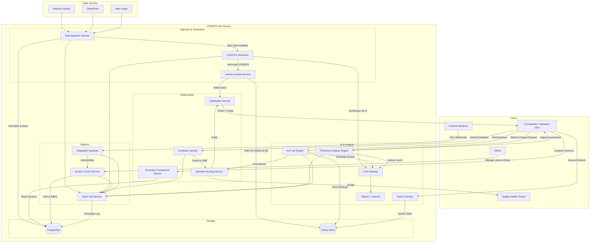

# Requirements Document

## Introduction - CONOPS One Source

The CPF Predictive Analysis Tool is an AI-powered system that provides commanders with predictive insights into the impact of proposed changes to CPF (COMPACFLEET, of Commander Pacific Fleet) asset operations. The tool ingests operational and sustainment data from multiple sources (network shares, SharePoint, web pages), generates a unified Concept of Operations (CONOPS) page, and enables interactive question-answering about the current CONOPS. By analyzing maintenance, sustainment, and operational data, the tool highlights potential future effects on assigned CPF assets, enabling proactive challenge mitigation and optimized resource allocation.

### System Overview

## Glossary

- **CPF_Asset**: any equipment, system, or resource assigned to a command post that is tracked for operational readiness and sustainment.
- **CONOPS**: Concept of Operations — a document describing how the commander intends to employ CPF assets, including operational timelines, resource allocation, and sustainment plans.
- **Predictive_Analysis_Engine**: The AI-powered component that processes ingested data and generates predictive insights about the impact of proposed changes on CPF assets.
- **Data_Ingestion_Service**: The component responsible for collecting and normalizing data from network shares, SharePoint, web pages, and other configured sources.
- **CONOPS_Generator**: The component that synthesizes ingested data into a single, unified Concept of Operations page.
- **QA_Interface**: The question-answering interface that allows users to ask natural language questions about the current CONOPS and receive contextual answers.
- **Sustainment_Data**: Maintenance schedules, repair records, supply chain status, logistics data, and other information related to keeping CPF assets operational.
- **Operational_Data**: Mission plans, deployment schedules, asset utilization records, readiness reports, and other data related to CPF asset operations.
- **Impact_Assessment**: A predictive report detailing the potential future effects of a proposed change on one or more CPF assets.
- **Data_Source**: A configured origin of data, including network shares, SharePoint sites, and web pages.
- **Commander**: The primary user role — a military commander or decision-maker who uses the tool to make informed decisions about CPF asset operations.
- **Ollama_Server**: The Ollama model serving infrastructure that hosts and serves the Gemma model locally, exposing an OpenAI-compatible API endpoint for inference requests.
- **LLM_Gateway**: The internal abstraction layer that connects to the Ollama_Server endpoint for all model inference requests.
- **Version_Control_Service**: The component responsible for managing CONOPS document versions, ensuring a single authoritative version is always identifiable and accessible.
- **NLP_QA_Engine**: The AI-powered natural language processing component that understands user questions and retrieves contextually relevant answers from the CONOPS document content.
- **Notification_Service**: The component responsible for sending automated notifications to registered users when CONOPS document changes or new versions are published.
- **Question_Routing_Service**: The component that manages unanswered questions by routing them to CONOPS owners or designated Subject_Matter_Experts and tracking resolution status.
- **SME**: Subject Matter Expert — a designated individual with domain expertise who can answer questions about specific CONOPS content areas.
- **Access_Control_Service**: The component responsible for managing user registration, authentication, and role-based access privileges to the CONOPS document and system features.
- **Search_Service**: The component that provides traditional keyword-based search functionality across CONOPS document content.
- **Audit_Trail_Service**: The component that maintains a complete, immutable record of all changes made to the CONOPS document, including authorship, timestamps, and change details.
- **Feedback_Service**: The component that enables users to submit feedback, error reports, and improvement suggestions for the CONOPS document.
- **Document_Comparison_Service**: The component that compares different versions of the CONOPS document and visually highlights changes between them.
- **Integration_Gateway**: The component that provides extensible interfaces for integrating the CONOPS One Source system with external systems.

## Requirements

### Requirement 1: Multi-Source Data Ingestion

**User Story:** As a user, I want the tool to ingest data from multiple sources, so that I have a comprehensive dataset for predictive analysis.

#### Acceptance Criteria

1. THE Data_Ingestion_Service SHALL support ingestion from network shares, SharePoint sites, and web pages as Data_Sources.
2. WHEN a new Data_Source is configured, THE Data_Ingestion_Service SHALL validate connectivity and access permissions before initiating ingestion.
3. WHEN data ingestion from a Data_Source completes, THE Data_Ingestion_Service SHALL normalize the ingested data into a common internal format.
4. IF a Data_Source is unreachable during ingestion, THEN THE Data_Ingestion_Service SHALL log the failure, retry ingestion up to 3 times with exponential backoff, and notify the Commander of the failure if all retries are exhausted.
5. WHEN data is ingested, THE Data_Ingestion_Service SHALL tag each record with its source type, ingestion timestamp, and source identifier.
6. THE Data_Ingestion_Service SHALL support both scheduled and on-demand ingestion runs.

### Requirement 2: Unified CONOPS Generation

**User Story:** As a user, I want the tool to generate a single Concept of Operations page from all ingested data, so that I have a consolidated operational picture.

#### Acceptance Criteria

1. WHEN all configured Data_Sources have been ingested, THE CONOPS_Generator SHALL produce a single CONOPS page that synthesizes Operational_Data and Sustainment_Data.
2. THE CONOPS_Generator SHALL include the following sections in the CONOPS page: mission overview, asset inventory, operational timelines, sustainment status, and resource allocation summary.
3. WHEN new data is ingested that differs from the previous ingestion, THE CONOPS_Generator SHALL update the CONOPS page to reflect the latest data.
4. THE CONOPS_Generator SHALL display the last-updated timestamp on the CONOPS page.
5. IF insufficient data is available to populate a CONOPS section, THEN THE CONOPS_Generator SHALL display a clear indication that the section has incomplete data and identify the missing Data_Sources.

### Requirement 3: Predictive Impact Analysis

**User Story:** As a user, I want to understand the potential future effects of proposed changes on CPF assets, so that I can make informed decisions and proactively mitigate challenges.

#### Acceptance Criteria

1. WHEN a User submits a proposed change to CPF_Asset operations, THE Predictive_Analysis_Engine SHALL generate an Impact_Assessment within 60 seconds.
2. THE Predictive_Analysis_Engine SHALL analyze the proposed change against current Operational_Data and Sustainment_Data to identify affected CPF_Assets.
3. THE Impact_Assessment SHALL include: a list of affected CPF_Assets, the predicted nature of impact (positive, negative, or neutral) for each asset, a confidence score for each prediction, and recommended mitigation actions for negative impacts.
4. WHEN a proposed change affects multiple CPF_Assets, THE Predictive_Analysis_Engine SHALL identify and display cascading effects across the asset portfolio.
5. THE Predictive_Analysis_Engine SHALL incorporate maintenance schedules and sustainment timelines when calculating predicted impacts.
6. IF the Predictive_Analysis_Engine determines that a proposed change has a high-risk negative impact on any CPF_Asset, THEN THE Predictive_Analysis_Engine SHALL flag the Impact_Assessment with a prominent warning indicator.

### Requirement 4: CONOPS Question-Answering

**User Story:** As a user, I want to ask natural language questions about the current CONOPS, so that I can quickly retrieve specific operational information without manually searching the document.

#### Acceptance Criteria

1. WHEN a user submits a natural language question through the QA_Interface, THE QA_Interface SHALL return a contextual answer derived from the current CONOPS within 10 seconds.
2. THE QA_Interface SHALL cite the specific CONOPS sections and source data used to formulate each answer.
3. IF the QA_Interface cannot find relevant information in the CONOPS to answer a question, THEN THE QA_Interface SHALL inform the User that the information is not available in the current CONOPS and suggest related topics that are available.
4. THE QA_Interface SHALL maintain conversation context within a session, allowing follow-up questions that reference previous answers.
5. WHEN the CONOPS page is updated, THE QA_Interface SHALL use the latest version of the CONOPS for all subsequent answers.

### Requirement 5: Resource Allocation Optimization

**User Story:** As a user, I want the tool to recommend optimized resource allocation based on predictive analysis, so that I can maximize operational readiness across CPF assets.

#### Acceptance Criteria

1. WHEN an Impact_Assessment is generated, THE Predictive_Analysis_Engine SHALL include resource reallocation recommendations that optimize overall CPF_Asset readiness.
2. THE Predictive_Analysis_Engine SHALL consider current asset utilization, maintenance schedules, and mission priorities when generating resource allocation recommendations.
3. WHEN multiple resource allocation options exist, THE Predictive_Analysis_Engine SHALL rank the options by predicted effectiveness and present the top 3 recommendations to the User.
4. THE Predictive_Analysis_Engine SHALL display the trade-offs associated with each resource allocation recommendation, including impact on individual CPF_Asset readiness scores.

### Requirement 6: Data Source Management

**User Story:** As a User, I want to configure and manage the data sources that feed the tool, so that I can control what information is used for analysis.

#### Acceptance Criteria

1. THE Data_Ingestion_Service SHALL provide an interface for the User to add, edit, and remove Data_Sources.
2. WHEN a User adds a new Data_Source, THE Data_Ingestion_Service SHALL require the source type (network share, SharePoint, or web page), connection URI, and access credentials.
3. WHEN a User saves a Data_Source configuration, THE Data_Ingestion_Service SHALL perform a connectivity test and report the result to the User.
4. THE Data_Ingestion_Service SHALL display the status of each configured Data_Source, including last successful ingestion time and current connectivity status.
5. IF a User removes a Data_Source, THEN THE Data_Ingestion_Service SHALL prompt for confirmation and, upon confirmation, remove the source configuration and mark associated ingested data as stale.

### Requirement 7: Audit and Traceability

**User Story:** As a User, I want a complete audit trail of all analyses and decisions supported by the tool, so that I can review the basis for past decisions.

#### Acceptance Criteria

1. THE Predictive_Analysis_Engine SHALL log every Impact_Assessment generated, including the input parameters, results, and timestamp.
2. THE QA_Interface SHALL log every question asked and answer provided, including the CONOPS version used.
3. WHEN a User requests an audit report, THE Predictive_Analysis_Engine SHALL generate a report listing all Impact_Assessments and QA interactions within a specified date range.
4. THE Data_Ingestion_Service SHALL maintain a log of all ingestion events, including source, timestamp, record count, and success or failure status.
5. THE user can ask about the status of an asset for a particular moment in time

### Requirement 8: User Management

**User Story:** As an Administrator User, I want to be able to add ane remove users to the system.

#### Acceptance Criteria

1. THE admin user will be able to add and remove users
2. THERE will be a page that lists all users and the ability to add or remove users and change their password
3. THE admin user will be able to see the last login time of the users

### Requirement 9: Portability

**User Story:** As an Administrator User, I want to be able to deploy this system to many environments. This application needs to run on a container on one computer. The LLM leveraged in the application needs to be a local model. For the first iteration, it will be a Gemma Model.

#### Acceptance Criteria

1. THE Admin user will be able to download the code and deploy it to another machine that is runninng docker. 
2. The model used will be Gemma, whatever the current version is
3. THE system SHALL use Ollama to serve the Gemma model locally.
4. THE deployment process SHALL include automated download and setup of Ollama.
5. THE Ollama_Server SHALL be configured to serve the Gemma model and expose an OpenAI-compatible API endpoint.
6. THE LLM_Gateway SHALL connect to the Ollama_Server endpoint for all inference requests.

### Requirement 10: Version Control and Single Source of Truth

**User Story:** As a user, I want unambiguous version control of the CONOPS document, so that all users are always accessing and referencing the most current and authoritative version with no ambiguity.

#### Acceptance Criteria

1. THE Version_Control_Service SHALL maintain a single authoritative version of the CONOPS document at all times, identified by a monotonically increasing version number.
2. WHEN a user requests the CONOPS document, THE Version_Control_Service SHALL return the latest published version by default.
3. THE Version_Control_Service SHALL prevent concurrent modifications from producing conflicting versions of the CONOPS document.
4. WHEN a new CONOPS version is published, THE Version_Control_Service SHALL mark the previous version as superseded and retain it for historical reference.
5. THE Version_Control_Service SHALL display the current version number, publication timestamp, and authoring source on every CONOPS document view.

> **Note:** This requirement extends Requirement 2 (Unified CONOPS Generation) by adding explicit version control guarantees. Requirement 2 covers CONOPS generation and updates; this requirement ensures version integrity and single-source-of-truth semantics.

### Requirement 11: AI-Powered Question Answering (NLP)

**User Story:** As a user, I want to ask natural language questions about the CONOPS and receive accurate, contextually relevant answers from the document content, so that I can quickly find the information I need.

#### Acceptance Criteria

1. WHEN a user submits a natural language question, THE NLP_QA_Engine SHALL parse the question intent and retrieve contextually relevant passages from the CONOPS document.
2. THE NLP_QA_Engine SHALL return answers that are accurate and grounded in the CONOPS document content, with no fabricated information.
3. THE NLP_QA_Engine SHALL support follow-up questions that reference prior context within the same session.
4. WHEN the NLP_QA_Engine returns an answer, THE NLP_QA_Engine SHALL include confidence indicators and the specific CONOPS sections referenced.
5. IF the NLP_QA_Engine cannot determine an answer from the CONOPS content, THEN THE NLP_QA_Engine SHALL indicate that the information is not available and route the question to the Question_Routing_Service.

> **Note:** This requirement overlaps with Requirement 4 (CONOPS Question-Answering). Requirement 4 defines the QA_Interface behavior and session management; this requirement emphasizes NLP accuracy, grounding, confidence indicators, and integration with the Question_Routing_Service for unanswered questions.

### Requirement 12: Automated Change Notifications

**User Story:** As a registered user, I want to receive instant and reliable notifications whenever a new CONOPS version is released or changes are made, so that I am always aware of the latest updates.

#### Acceptance Criteria

1. WHEN a new CONOPS version is published, THE Notification_Service SHALL send a notification to all registered users within 60 seconds of publication.
2. THE Notification_Service SHALL include in each notification the CONOPS version number, publication timestamp, and a summary of the sections that have been modified.
3. THE Notification_Service SHALL support multiple notification channels (email and in-application notifications at minimum).
4. WHEN a user registers for notifications, THE Notification_Service SHALL confirm the registration and allow the user to select preferred notification channels.
5. IF the Notification_Service fails to deliver a notification, THEN THE Notification_Service SHALL retry delivery up to 3 times and log the failure for administrative review.

### Requirement 13: Unanswered Question Routing and Management

**User Story:** As a user, I want unanswered questions to be routed to CONOPS owners or designated SMEs, so that I receive timely and authoritative responses to questions the AI cannot answer.

#### Acceptance Criteria

1. WHEN the NLP_QA_Engine cannot answer a user question, THE Question_Routing_Service SHALL route the question to the designated CONOPS owner or appropriate SME.
2. THE Question_Routing_Service SHALL track the status of each routed question (pending, assigned, answered, closed).
3. THE Question_Routing_Service SHALL notify the original questioner when a routed question receives a response.
4. IF a routed question remains unanswered for more than 48 hours, THEN THE Question_Routing_Service SHALL escalate the question by sending a reminder to the assigned SME and notifying the CONOPS owner.
5. THE Question_Routing_Service SHALL maintain a searchable log of all routed questions and their resolutions for future reference.

### Requirement 14: User Registration and Access Control

**User Story:** As an administrator, I want a secure system for registering users and managing access privileges, so that only authorized personnel can access sensitive CONOPS information.

#### Acceptance Criteria

1. THE Access_Control_Service SHALL require user registration with a unique username, password meeting complexity requirements, and assigned role before granting system access.
2. THE Access_Control_Service SHALL enforce role-based access control with at minimum three roles: admin, standard user, and read-only viewer.
3. WHEN a user attempts to access a restricted resource without the required role, THE Access_Control_Service SHALL deny access and return a clear authorization error.
4. THE Access_Control_Service SHALL support account deactivation without deletion, preserving audit history for deactivated accounts.
5. WHEN a new user is registered, THE Access_Control_Service SHALL send a confirmation notification and require initial password change on first login.

> **Note:** This requirement extends Requirement 8 (User Management). Requirement 8 covers basic admin add/remove/password operations; this requirement adds registration workflows, role-based access control with additional roles (read-only viewer), account deactivation, and first-login password change.

### Requirement 15: Keyword Search Functionality

**User Story:** As a user, I want to search the CONOPS document using traditional keyword search, so that I can find specific information using familiar search methods in addition to AI-powered question answering.

#### Acceptance Criteria

1. THE Search_Service SHALL provide keyword-based search across all sections of the current CONOPS document.
2. WHEN a user submits a keyword search query, THE Search_Service SHALL return matching results ranked by relevance within 5 seconds.
3. THE Search_Service SHALL support exact phrase matching, boolean operators (AND, OR, NOT), and wildcard searches.
4. THE Search_Service SHALL highlight matching keywords within the returned search results.
5. WHEN the CONOPS document is updated, THE Search_Service SHALL re-index the document content to ensure search results reflect the latest version.

### Requirement 16: Audit Trail and Change History

**User Story:** As a user, I want a complete audit trail of all changes made to the CONOPS document, so that I have full accountability and transparency into who changed what and when.

#### Acceptance Criteria

1. THE Audit_Trail_Service SHALL log every modification to the CONOPS document, including the identity of the user who made the change, the timestamp, and a description of the change.
2. THE Audit_Trail_Service SHALL store audit records in an immutable, append-only log that cannot be modified or deleted by any user.
3. WHEN a user requests the change history for a specific CONOPS section, THE Audit_Trail_Service SHALL return a chronological list of all changes to that section.
4. THE Audit_Trail_Service SHALL support filtering audit records by user, date range, section, and change type.
5. THE Audit_Trail_Service SHALL retain audit records for the lifetime of the system with no automatic purging.

> **Note:** This requirement overlaps with Requirement 7 (Audit and Traceability). Requirement 7 covers audit logging for system events (impact assessments, QA interactions, ingestion events); this requirement focuses specifically on CONOPS document change tracking with immutability guarantees, section-level history, and retention policies.

### Requirement 17: User Feedback Mechanism

**User Story:** As a user, I want to provide feedback on the CONOPS document, report errors or inconsistencies, and suggest improvements, so that the CONOPS can be continuously improved.

#### Acceptance Criteria

1. THE Feedback_Service SHALL provide an interface for users to submit feedback on specific CONOPS sections, including error reports, inconsistency flags, and improvement suggestions.
2. WHEN a user submits feedback, THE Feedback_Service SHALL categorize the feedback (error, inconsistency, suggestion, general) and assign a tracking identifier.
3. THE Feedback_Service SHALL route feedback to the CONOPS owner or designated SME for review and resolution.
4. THE Feedback_Service SHALL track the status of each feedback item (submitted, under review, resolved, rejected) and notify the submitting user of status changes.
5. WHEN feedback is resolved, THE Feedback_Service SHALL record the resolution details and link the feedback to any resulting CONOPS changes.

### Requirement 18: Document Comparison and Change Highlighting

**User Story:** As a user, I want to compare different versions of the CONOPS document and see changes visually highlighted, so that I can quickly understand what has changed between versions.

#### Acceptance Criteria

1. WHEN a user selects two CONOPS versions for comparison, THE Document_Comparison_Service SHALL generate a side-by-side or inline diff view highlighting additions, deletions, and modifications.
2. THE Document_Comparison_Service SHALL support comparison between any two historical versions of the CONOPS document.
3. THE Document_Comparison_Service SHALL provide a summary of changes including the number of sections modified, added, or removed.
4. THE Document_Comparison_Service SHALL allow filtering the comparison view by specific CONOPS sections.
5. WHEN a user views a CONOPS version, THE Document_Comparison_Service SHALL provide a quick-compare option to view differences from the immediately preceding version.

### Requirement 19: Integration with Existing Systems

**User Story:** As an administrator, I want the CONOPS One Source system to integrate with existing organizational systems, so that data flows seamlessly and users can leverage existing tools alongside the new system.

#### Acceptance Criteria

1. THE Integration_Gateway SHALL provide a documented API for external systems to query CONOPS data, submit questions, and retrieve analysis results.
2. THE Integration_Gateway SHALL support webhook-based event notifications for CONOPS updates, new impact assessments, and other system events.
3. WHEN an external system sends a request through the Integration_Gateway, THE Integration_Gateway SHALL authenticate the request and enforce access control policies.
4. THE Integration_Gateway SHALL provide a plugin architecture that allows new system integrations to be added without modifying core application code.
5. THE Integration_Gateway SHALL log all external system interactions to the Audit_Trail_Service for traceability.
